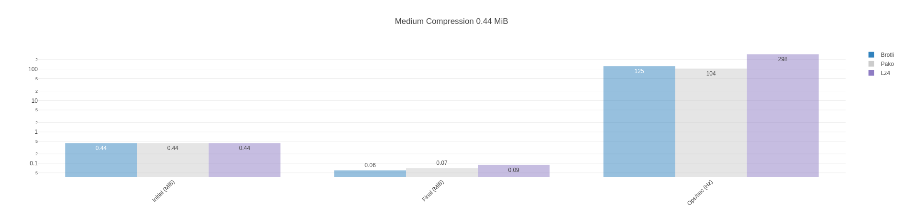
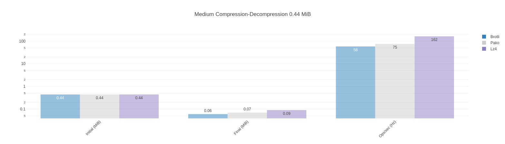
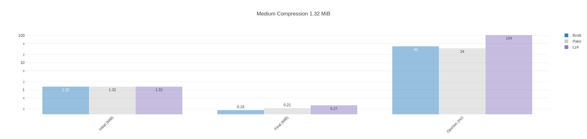
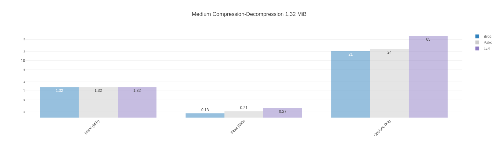
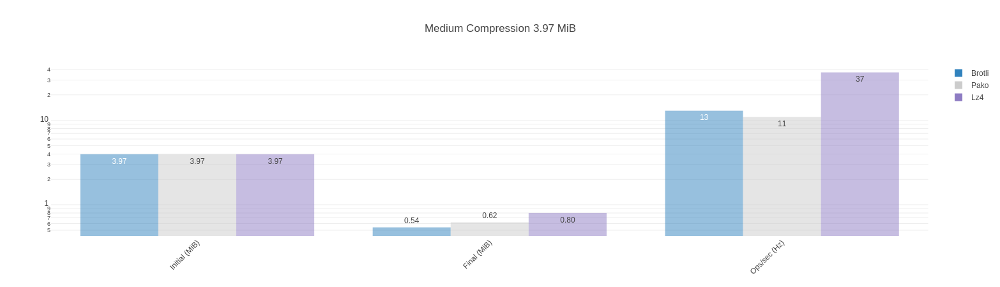
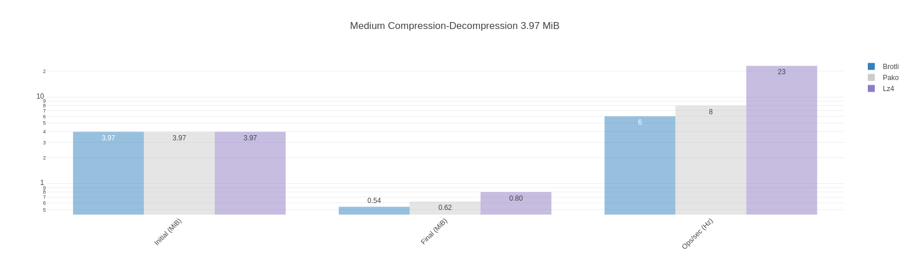
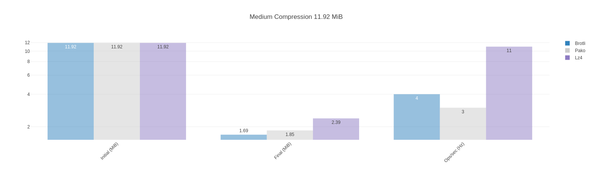
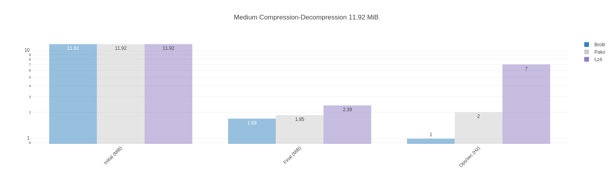

# Metrology Data Compression Benchmark

Suite of metrology data compression benchmarks based on the [fake metrology data](https://github.com/dstanesc/fake-metrology-data) library.

Currently tested libraries: `brotli`, `pako` and `lz4js`.

## Dependencies

```sh
$ node --version
v16.13.1

$ npm --version
8.1.2
```

## Execute Benchmark

```sh
npm run clean
npm install
npm start
```


## Typical Partial Report Result

incl. 2700 measurements, yields following results

```
Compression only, report size 11.92 MiB, brotli {"quality":1} compressed size 1.69 MiB, compression rate 85.80 %
Compression only, report size 11.92 MiB, pako {"level":1} compressed size 1.85 MiB, compression rate 84.51 %
Compression only, report size 11.92 MiB, lz4 (default) compressed size 2.39 MiB, compression rate 79.97 %
Brotli x 4.27 ops/sec ±3.25% (15 runs sampled)
Pako x 3.67 ops/sec ±3.42% (14 runs sampled)
Lz4js x 11.72 ops/sec ±2.09% (33 runs sampled)
The fastest option is Lz4js

Compression only, report size 11.92 MiB, brotli {"quality":5} compressed size 1.35 MiB, compression rate 88.71 %
Compression only, report size 11.92 MiB, pako {"level":5} compressed size 1.57 MiB, compression rate 86.84 %
Compression only, report size 11.92 MiB, lz4 (default) compressed size 2.39 MiB, compression rate 79.97 %
Brotli x 1.53 ops/sec ±5.18% (8 runs sampled)
Pako x 2.33 ops/sec ±2.23% (10 runs sampled)
Lz4js x 12.23 ops/sec ±1.52% (34 runs sampled)
The fastest option is Lz4js

Compression only, report size 11.92 MiB, brotli {"quality":11} compressed size 1.07 MiB, compression rate 91.04 %
Compression only, report size 11.92 MiB, pako {"level":9} compressed size 1.50 MiB, compression rate 87.40 %
Compression only, report size 11.92 MiB, lz4 (default) compressed size 2.39 MiB, compression rate 79.97 %
Brotli x 0.02 ops/sec ±2.11% (5 runs sampled)
Pako x 1.60 ops/sec ±2.71% (9 runs sampled)
Lz4js x 12.41 ops/sec ±1.67% (34 runs sampled)
The fastest option is Lz4js
```

Metrology report 100 measurements, original size 0.44 MiB




Metrology report 300 measurements, original size 1.32 MiB




Metrology report 900 measurements, original size 3.97 MiB




Metrology report 2700 measurements, original size 11.92 MiB





